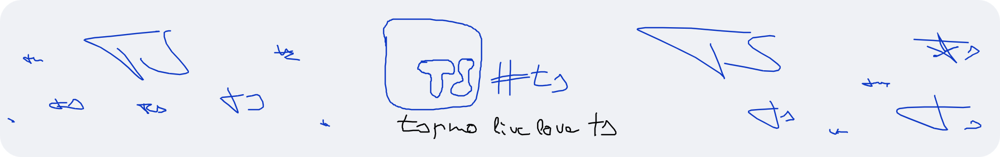

<h1 align="center">#ts</h1>
<p align="center"><em>#ts v2 ysws</em></p>


# About
#ts is a single shared, persistant whiteboard. Anyone can view the canvas; drawing is only allowed for admins who sign in via HC Auth.
Drawings get saved as vector operations in SQLite, so the drawing survives restarts and loads instantly for every visitor.  
Built for the #ts v2 YSWS (which never released). 
Built with TS (obviously), Express.js and EJS.  

# Features
* Hack Club Auth - for admin login; only whitelisted admins can save the whiteboard
* Undo / Redo - with CTRL+Z and CTRL+Y
* Drawing tools - pencil & marker with color switching and adjustable brush sizing

# Demo Video
(imagine theres a video)

# Demo Site (only during Hack Club Horizons review)
You can view the example instance running @ https://ts.quack.zip/  

# Setup
Rename [.env.example](.env.example) to .env, configure values.

Install the [Bun](https://bun.sh/) runtime. Then, run:
```sh
bun install
bun run start
```
The server will be active on `http://localhost:3000` (or whatever port you set it to)!

# AI Usage
Whilst creating, AI was used for the design (mainly formating) and help with the whiteboard math.